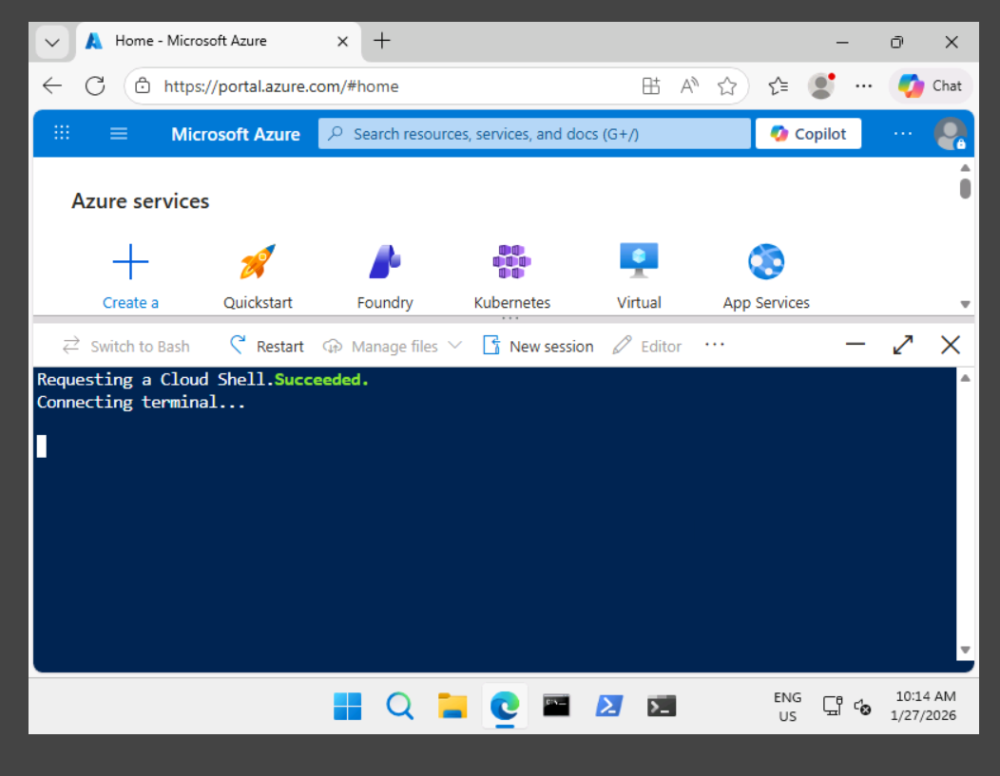
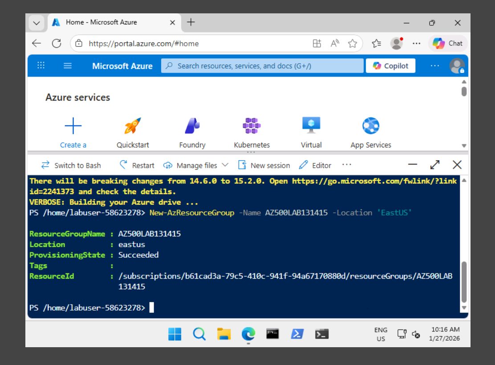
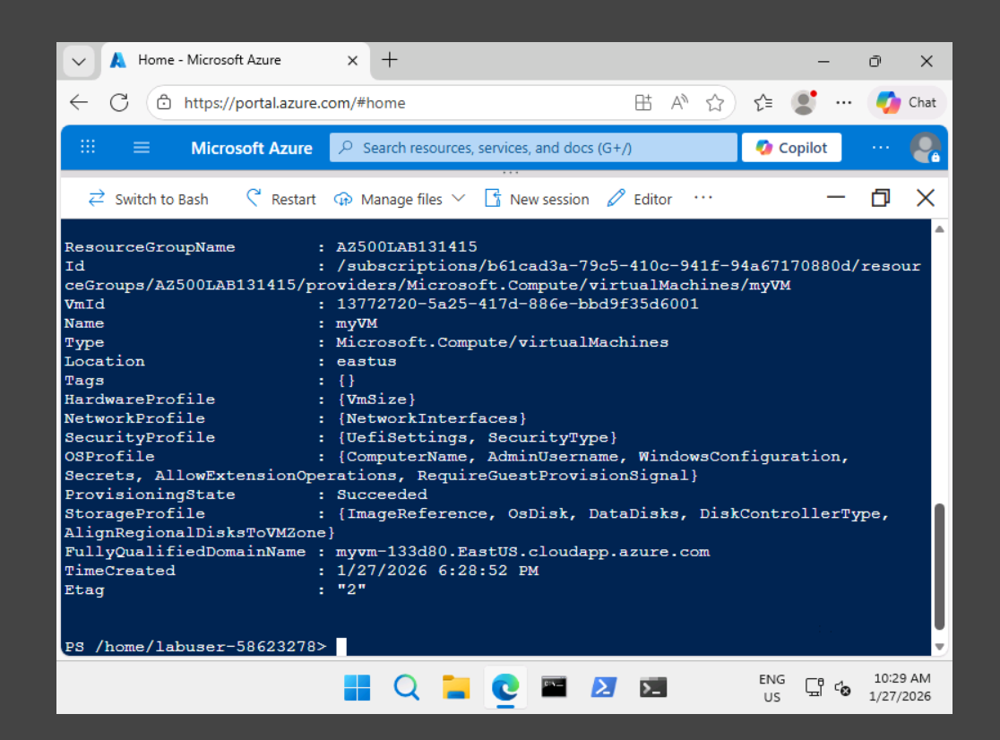
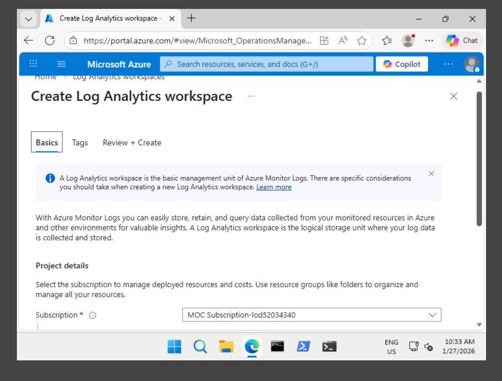
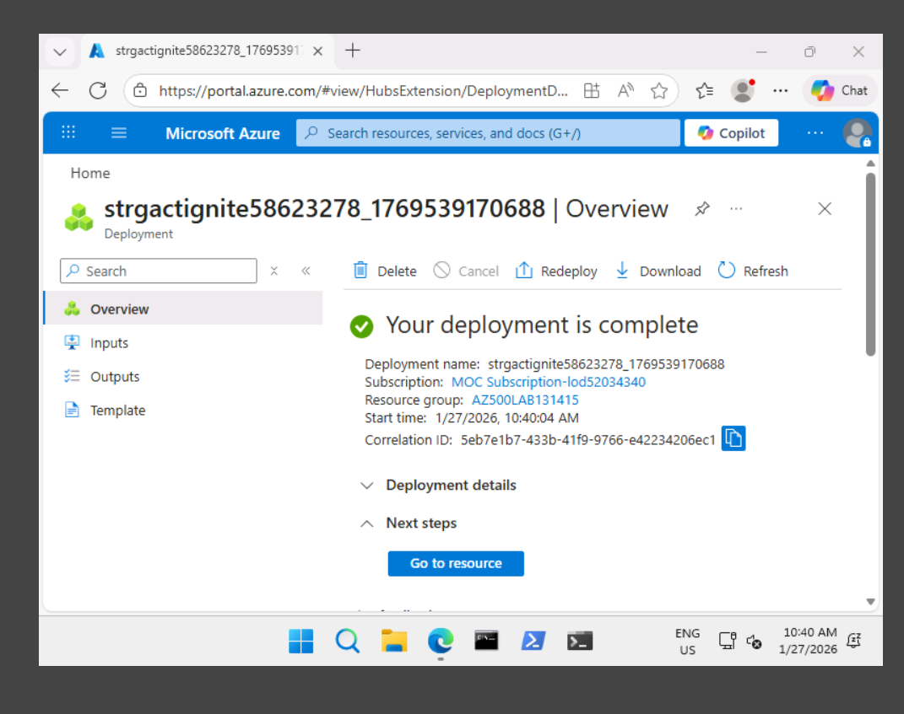
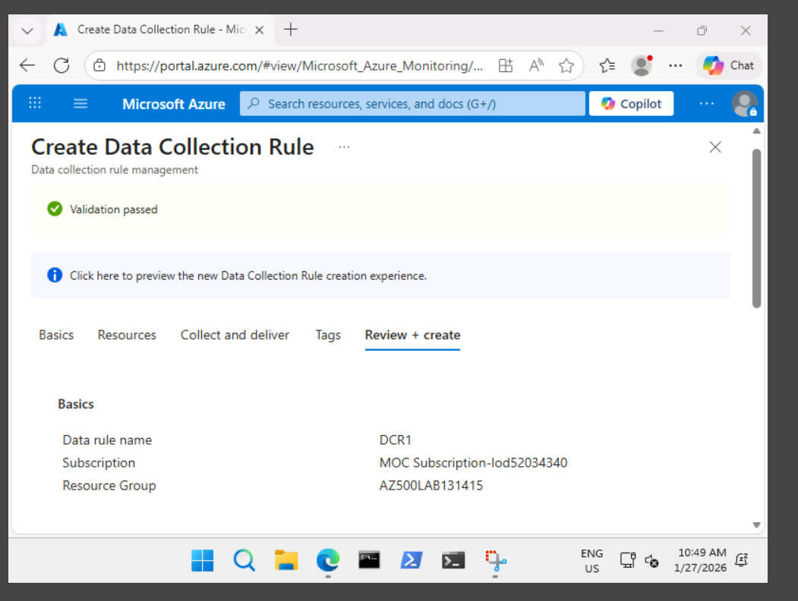
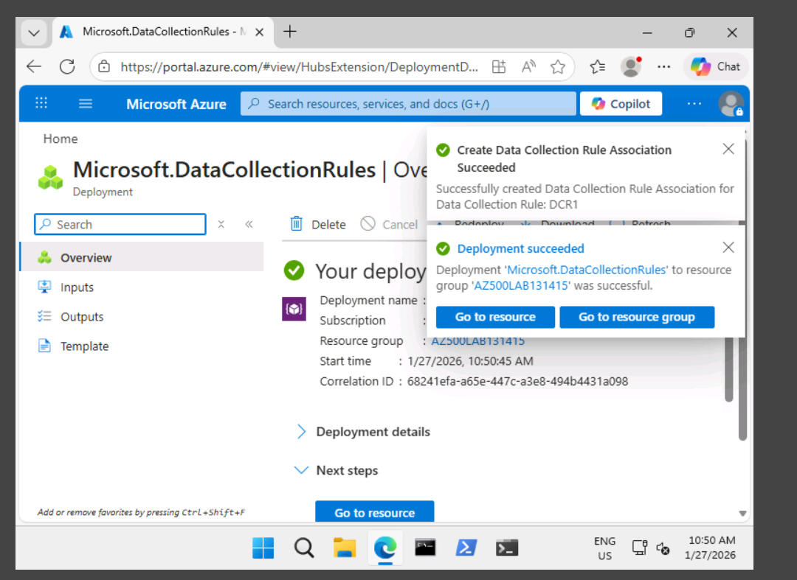

## Exercise 1: Deploy an Azure Virtual Machine

A Windows virtual machine was deployed using Azure PowerShell to serve as the telemetry source for monitoring and security services. Encryption at Host was enabled to align with data protection best practices.

### Screenshots

---

## Exercise 2: Create a Log Analytics Workspace

A Log Analytics Workspace was created to centralize performance metrics and system logs collected from Azure virtual machines. This workspace is required for Microsoft Defender for Cloud and Microsoft Sentinel.

### Screenshots

---

## Exercise 3: Create an Azure Storage Account

An Azure Storage Account was deployed to support Azure monitoring and diagnostic services.

### Screenshots

---

## Exercise 4: Create a Data Collection Rule (DCR)

A Data Collection Rule was configured using Azure Monitor Agent to collect performance counters from Windows virtual machines and route the data to Log Analytics.

Collected metrics include CPU, memory, disk, and network performance at 60-second intervals.

### Screenshots

